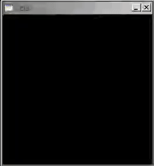

# cccc  

#### An Esoteric Domain-Specific Rasterization Language 

To makes things worse, its optimized and semi-obfuscated... 

## Overview

Memory is layed out in four 2-Dimensional grids. Each grid is represented using the cartesian coordinates, (x,y).
The first grid is the computational channel. Similar to a 2-dimensional turing tape. Just like a turing machine, there is a cursor that moves forward and backward across the tape. Initially, the cursor forward direction is in the positive x direction. The cursor maintains a x,y position in the computational grid. While the cursor's backward direction is defined as being the negative of its forward. The cursor's forward direction can be orthogonally rotated clockwise and counter-clockwise. This 2-dimensional is composed of 32 bit integers called cells

The remaining 3 grids define the RGB image channels. This is referred to as the canvas. The cursor also maintains the current image channel, either R,G, or B, and can be switched via instructions. And the current integer at the cursors x,y position can be written to the corresponding x,y position at this current channel.

## Brief
#### Memory 
4 2-Dimensional Grids

- Grid 1 is a computational grid of integers
- Grids 2,3,4 are image channels R,G, and B. Which are of unsigned chars. 
	
#### Cursor
 - moves forward and backward
 - rotates 90 degrees clockwise or counter clockwise. 
 - pushes values from the computational grid to any of the image channels  

# Instructions
	.   write cell value to respective position on current image channel         
	,   read user input into cell                       
	+   increment cell                            
	-   decrement cell                           
	[   end loop, will jump to loop end if cell is zero             
	]   end loop, will jump to loop beginning if cell is non-zero             
	>   move cursor forward                            
	<   move cursor backward                        
	/   rotate cursor clockwise                                  
	\   rotate cursor counter clockwise                                 
	(   push cursor stack 
	)   set cursor to top and pop stack         
	#   render the canvas                                    
	@   clear the canvas                                     
	}   move to next channel (in RGB order)                
	{   move to previous channel                             
	_   set cursor x position to cell value                
	|   set cursor y position to cell value 

# Build

Implementation contains an optional Brainfuck Interpreter, which omits all non-brainfuck instructions. 

### OpenGL Renderer

	make gl

### Brainfuck interpreter

	make bf 

# Usage
	Reads all  instruction input from stdin

###	Example OpenGL program

	cat examples/scanline.c4 | ./cccc 

####  Example Output

